# ⚡ AI Router — Production Two-Tier Local LLM Orchestrator

**Intelligent routing • Multi-workspace RAG • OpenAI-compatible API • Persistent semantic memory • Subagents • Clarity Engine**

Because sometimes a 4B model just needs to decide whether the problem actually deserves the 35B model.

A complete **local AI sovereignty stack** built for engineers who want maximum intelligence with zero cloud dependency, token costs, or context loss.

## Why This Stack Matters

This isn't another toy local LLM wrapper. It's a **production-grade orchestration layer** demonstrating:

- Hierarchical LLM routing & task classification
- Multi-agent subagent architecture
- Cross-workspace RAG at scale
- Persistent semantic memory across sessions
- Full OpenAI compatibility for seamless integration
- Real-world desktop agent capabilities

Built and battle-tested daily in Sanford, Florida on consumer hardware (RTX 4070 Super).

## ✨ Key Features

- **Smart Two-Tier Routing** — 4B sorter analyzes query + RAG + history and either answers directly or writes a precise mission brief for the 35B thinker
- **Two-Pass Refinement** — `router-two-pass` drafts with the 35B, then runs a critic pass that rewrites it into a stronger final answer (temperature=0 on pass 2). Optional red-team prepend for authorized pentest work.
- **AnythingLLM RAG** — 10 specialized workspaces with automatic URL-based switching and browser extension capture
- **Persistent Semantic Memory** — Every conversation turn is summarized and stored for lifelong context recall
- **Clarity Engine Integration** — Live priority-tree state injection in `router-assistant` mode
- **Subagent Framework** — `router-fast`, `router-sub-coder`, `router-sub-critic`, `router-sub-draft`, `router-sub-research`
- **OpenAI-Compatible Server** — Full `/v1/chat/completions` endpoint (works with OpenClaw, LangChain, CrewAI, etc.)
- **Streamlit Dashboard** + compiled Windows exes + Docker Compose support
- **Desktop Control Primitives** — Agents can control mouse, keyboard, screenshots, windows, and clipboard

## 🚀 Quick Start (Windows)

```powershell
# From project root
.\invoke.ps1 -Check          # Full boot health check
.\invoke.ps1 -Serve          # Start Router API on http://localhost:3839
.\invoke.ps1 -Dashboard      # Launch Streamlit UI on http://localhost:8501
```

Or double-click the desktop shortcuts:

- **AI Router** — starts the full server + boot checklist
- **AI Dashboard** — launches the Streamlit UI

CLI mode: `.\invoke.ps1`

## 📡 Services

| Service              | Port  | Purpose                                       |
|----------------------|-------|-----------------------------------------------|
| Router API           | 3839  | OpenAI-compatible `/v1/chat/completions`      |
| Streamlit Dashboard  | 8501  | Rich web chat interface                       |
| Ollama               | 11434 | Local inference (4B sorter + 35B thinker)     |
| AnythingLLM          | 3001  | Multi-workspace RAG engine                    |
| OpenClaw Gateway     | 18789 | Discord + tool-calling bridge                 |
| Clarity Engine       | 3747  | Typed priority tree (assistant mode)          |

## 🔀 Model Aliases

| Alias                          | Behavior                                               |
|--------------------------------|--------------------------------------------------------|
| `router`                       | Default intelligent two-tier routing (recommended)     |
| `router-assistant`             | 35B + cross-workspace RAG + Clarity Engine             |
| `router-fast`                  | Speed-first (safe tasks → free models)                 |
| `router-sub-coder`             | Code generation specialist                             |
| `router-sub-critic`            | Output reviewer                                        |
| `router-sub-research`          | Deep research synthesizer                              |
| `router-two-pass`              | Draft + critic refinement (high-quality)               |
| `router-two-pass-uncensored`   | Same + red-team prepend (authorized pentest)           |

## Architecture

```mermaid
graph TD
    A[User / OpenClaw / Dashboard] --> B[Router Server :3839]
    B --> C[4B Sorter + Classifier]
    C -->|Simple / Safe| D[Direct 4B Answer]
    C -->|Complex| E[35B Thinker]
    E --> F[AnythingLLM RAG + Cross-Workspace]
    E --> G[Persistent Memory Recall]
    E --> H[Clarity Engine State]
    F & G & H --> E
    style B fill:#1a2a4a,stroke:#4f8ef7,stroke-width:3px
```



## Workspaces (AnythingLLM)

10 specialized RAG workspaces with automatic URL-pattern switching:

`assistant` • `tim` • `tcg-dot-bot` • `movie_poster` • `projects` • `pen-test` • `substances` • `journal` • `ideas` • `private`

## CLI Commands

Inside the CLI router type `/help` for the full list:

- `/workspace` & `/workspace <slug>` — switch workspace
- `/project <name>` — switch project (auto-maps workspace)
- `/capture` — grab current browser page and embed it
- `/rag-add <title> | <text>` — add text to current workspace
- `/rag-file <path>` — upload and embed a file
- `/export` — save conversation as markdown
- `/history` • `/clear` • `/models` • `/status` • `/workspace-list` • `/projects`

## File Layout

```
AI STACK/
├── bin/                     ← Compiled .exe files
│   ├── AI Router.exe
│   └── AI Router CLI.exe
├── src/                     ← Source code
│   ├── router_server.py
│   ├── ai_router_v2.py
│   └── dashboard.py
├── core/                    ← Shared modular package (prompts, session, RAG, memory, two-pass)
├── launch_*.bat             ← One-click launchers
├── invoke.ps1               ← PowerShell Swiss Army knife
├── desktop.ps1              ← Desktop control primitives for agents
├── docker-compose.yml       ← Containerized deployment
├── README.md                ← You are here
├── USER_MANUAL.md           ← Full alias reference, two-pass explainer, troubleshooting
└── SETUP.md                 ← Detailed setup
```

## Rebuilding Executables

```powershell
python -m PyInstaller --onefile --name "AI Router" --icon router.ico --distpath bin src/router_server.py
python -m PyInstaller --onefile --name "AI Router CLI" --icon router.ico --distpath bin src/ai_router_v2.py
```

## Docker Support

```bash
docker compose up -d
```

## Tech Stack

- **Core:** Python 3.12 + FastAPI + Uvicorn
- **LLMs:** Ollama (Qwen3.5-abliterated 4B/35B + fast free models)
- **RAG:** AnythingLLM (10 workspaces)
- **UI:** Streamlit + custom CSS
- **Memory:** Auto-summarization + vector recall
- **Deployment:** Compiled Windows exes, Docker Compose, PowerShell automation

---

*Local AI sovereignty, maximized.*
*Core v0.2.0 — Built with precision in Sanford, Florida.*
*Made for engineers who want their AI stack to be as sharp as their code.*
